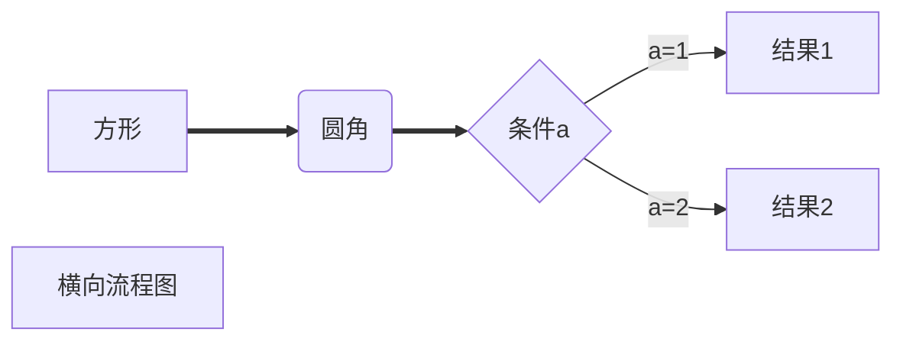

```c
int<stdio.h>
    int main(){
    
}
```

==jian==

x~1~^2^

$x_1^2$

## 一、Hello World!

##### 二、你好


1. 

2.  

3.  

   1.  

      1.  

         1.   

            1. - [ ] 吃早饭

               - [x] 睡觉

                 - [ ] >   
                   >
                   >  
                   >
                   >   
                   >
                   > > >
                   > > >
                   > > >>
                   > > >>
                   > > >>>
                   > > >>>
                   > > >>>>
                   > > >>>>
                   > > >>>>>
                   > > >>>>>>
                   > > >>>>>>
                   > > >>>>>>>
                   > > >>>>>>>
                   > > >>>>>>> 
                   > > >>>>>>>
                   > > >>>>>>> 
                   > > >>>>>>>
                   > > >>>>>>>>
                   > > >>>>>>>
                   > > >>>>>>>>>
                   > > >>>>>>>>
                   > > >>>>>>>>
                   > > >>>>>>>>>
                   > > >>>>>>>>
                   > > >>>>>>>>>
                   > > >>>>>>>>
                   > > >>>>>>>>
                   > > >>>>>>>>
                   > > >>>>>>>>
                   > > >>>>>>>>>>
                   > > >>>>>>>>>>
                   > > >>>>>>>>>>
                   > > >>>>>>>>>
                   > > >>>>>>>>>>
                   > > >>>>>>>>>
                   > > >>>>>>>>>>
                   > > >>>>>>>>>>
                   > > >>>>>>>>>>>
                   > > >>>>>>>>>
                   > > >>>>>>>>>>
                   > > >>>>>>>>>>
                   > > >>>>>>>>>>>
                   > > >>>>>>>>>>
                   > > >>>>>>>>>>>
                   > > >>>>>>>>>>>>
                   > > >>>>>>>>>>>>
                   > > >>>>>>>>>>>>>
                   > > >>>>>>>>>>>>
                   > > >>>>>>>>>>>>>
                   > > >>>>>>>>>>>>
                   > > >>>>>>>>>>>>>
                   > > >>>>>>>>>>>>
                   > > >>>>>>>>>>>> >
                   > > >>>>>>>>>>>> >
                   > > >>>>>>>>>>>> >> 
                   > > >>>>>>>>>>>> >
                   > > >>>>>>>>>>>> >int main
                   > > >>>>>>>>>>>> >
                   > > >>>>>>>>>>>> >

 - 

[百度一下](https://www.baidu.com "https://www.baidu.com")

tmmd[^1]


[^1]:“一句问候语”<br>解释为：你妈妈的


* 

* 
  * 

[标题一](##一、Hello World!)

[标题六](######二、你好)

文字[^2]


[^2]:你好

|                    |      |      |      |
| ------------------ | ---- | ---- | ---- |
|                    |      |      |      |
| <br />             |      |      |      |
|                    |      |      |      |
|                    |      |      |      |
|                    |      |      |      |
| <br /><br />       |      |      |      |
| <br />             |      |      |      |
| <br />             |      |      |      |
|                    |      |      |      |
|                    |      |      |      |
|                    |      |      |      |
| <br /><br /><br /> |      |      |      |




:happy:、:cry:、:anger:、 :sob:、:boy:


```c

```


```

```

